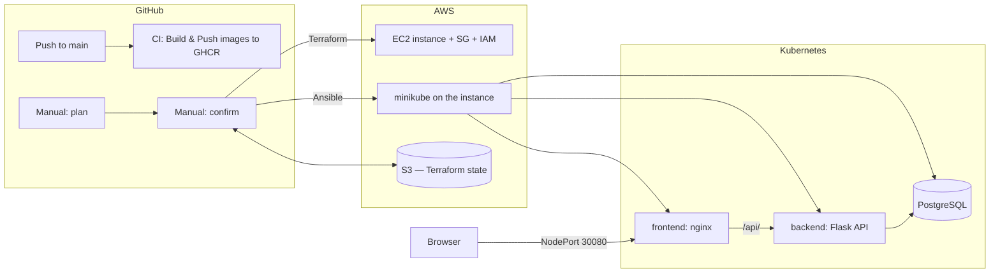

# ShopList — End-to-End DevOps Project

A complete DevOps pipeline that provisions cloud infrastructure from code and deploys a
containerized 3-tier web application to Kubernetes — all through CI/CD, with no manual
server setup.

**Stack:** Terraform · Ansible · Docker · Kubernetes (minikube) · GitHub Actions · AWS (EC2, S3) · GHCR

## Architecture



**The application** is a simple shopping-list manager:

| Tier      | Technology              | Details                                             |
|-----------|-------------------------|-----------------------------------------------------|
| Frontend  | nginx + vanilla JS      | Serves static UI, proxies `/api/` to the backend    |
| Backend   | Python Flask            | REST API (`/products`, `/health`)                   |
| Database  | PostgreSQL 15           | Persistent volume, initialized via ConfigMap        |

## Repository layout

```
app/            Frontend & backend source + Dockerfiles
docker/         docker-compose for local development
kubernetes/     K8s manifests (deployments, services, PVC, secret, configmap)
terraform/      Infrastructure as code (EC2, security group, IAM) — state in S3
ansible/        Playbooks: install minikube, deploy the app
.github/
  workflows/
    ci-cd.yml         Build & push Docker images to GHCR on every app change
    create-infra.yml  Provision / destroy the AWS environment (plan → confirm)
```

## CI/CD pipelines

### 1. Build & Push (`ci-cd.yml`)
Triggered automatically on every push that changes `app/**` (or manually).
Builds the backend and frontend Docker images, runs a dependency smoke test,
and pushes them to GitHub Container Registry tagged with the commit's short SHA.

### 2. Create/Destroy Lab Infra (`create-infra.yml`)
A two-step, human-approved infrastructure pipeline:

1. **`stage: plan`** — runs `terraform plan` against the S3-backed state and posts
   the full plan to the job summary for review. Touches nothing.
2. **`stage: confirm`** — a second, deliberate manual run. Applies the changes,
   waits for SSH, then runs Ansible to install minikube and deploy the app.
   Ends with the live app URL in the job summary.

The same pipeline tears everything down with `action: destroy` (plan → confirm),
so the environment is fully disposable and reproducible.

**Design decisions:**
- Terraform state lives in **S3**, so every pipeline run (and local run) shares one
  source of truth — no state drift between machines.
- A **concurrency group** prevents two runs from mutating state at the same time.
- The apply step is gated behind a **separate manual confirm run**, so no infra
  change happens without a human reading the plan first.
- No credentials in the repo: AWS keys and the SSH private key are **GitHub Secrets**.

## Running it yourself

**One-time setup**
1. Create an AWS key pair (EC2 → Key Pairs) and an S3 bucket for Terraform state
   (update `terraform/backend.tf` with your bucket name).
2. Add repository secrets: `AWS_ACCESS_KEY_ID`, `AWS_SECRET_ACCESS_KEY`,
   `EC2_SSH_KEY` (the key pair's private key).

**Deploy**
1. Actions → *Build, Push and Deploy* → Run workflow (builds the images).
2. Actions → *Create/Destroy Lab Infra* → Run with `stage: plan` → review the summary.
3. Run again with `stage: confirm` → when it finishes, the app URL
   (`http://<public-ip>:30080`) appears in the job summary.

**Tear down**
Run the same workflow twice with `action: destroy` (`plan`, then `confirm`).

## Local development

```bash
cd docker
docker compose up --build
# app at http://localhost:8888
```
